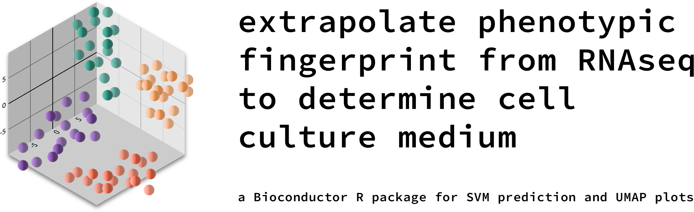
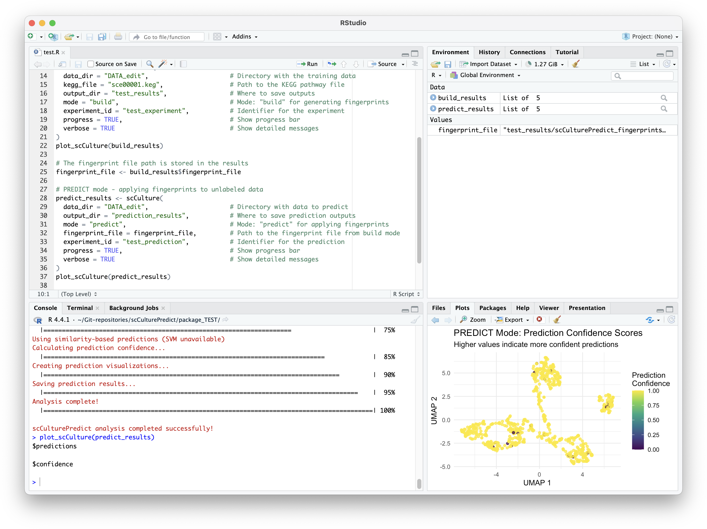

# scCulturePredict

[](https://bioconductor.org/)
[](https://www.r-project.org/)
[](https://opensource.org/licenses/MIT)
[](https://codecov.io/gh/NCMBianchi/scCulturePredict)

## Build and Apply Transcriptomic Fingerprints for Cell Culture Media Prediction

scCulturePredict is an R package that provides dual functionality for cell culture media prediction from single-cell transcriptomic data. **BUILD mode** generates transferable transcriptomic fingerprints from labeled training data, while **PREDICT mode** applies these pre-built fingerprints to unlabeled datasets for culture condition prediction.



## Features

### BUILD Mode (Generate Fingerprints)
- Train on labeled single-cell datasets
- Generate transferable transcriptomic fingerprints using KEGG pathway analysis
- Train both similarity-based and SVM prediction models
- Evaluate model performance with cross-validation
- Save fingerprints and models for future predictions

### PREDICT Mode (Apply Fingerprints)
- Apply pre-built fingerprints to unlabeled datasets
- Make culture media predictions using trained models
- Calculate prediction confidence scores
- Generate prediction-specific visualizations

### Core Capabilities
- Load and preprocess single-cell data (supports both CSV and 10X Genomics formats)
- Perform dimensionality reduction with UMAP and t-SNE
- Integrate with Seurat workflows
- Comprehensive evaluation and visualization tools



## Installation

### From Bioconductor (currently under review)

```r
if (!requireNamespace("BiocManager", quietly = TRUE))
    install.packages("BiocManager")
BiocManager::install("scCulturePredict")
```

### From GitHub (development version)

```r
# install.packages("devtools")
devtools::install_github("nccb/scCulturePredict")
```

## Quick Start

### BUILD Mode: Generate Fingerprints from Labeled Data

```r
library(scCulturePredict)

# Build fingerprints from labeled training data
training_results <- scumap(
  data_dir = "./DATA_labeled",
  kegg_file = "kegg_file",
  output_dir = "./training_results",
  mode = "build",
  experiment_id = "training",
  progress = TRUE,
  verbose = TRUE
)

# Access training results
fingerprint_file <- training_results$fingerprint_file
training_accuracy <- training_results$evaluation_results$overall_accuracy
print(paste("Training accuracy:", training_accuracy))
```

### PREDICT Mode: Apply Fingerprints to New Data

```r
# Apply fingerprints to unlabeled data
prediction_results <- scumap(
  data_dir = "./DATA_unlabeled",
  output_dir = "./prediction_results",
  mode = "predict",
  fingerprint_file = fingerprint_file,
  experiment_id = "predictions",
  progress = TRUE,
  verbose = TRUE
)

# Access predictions
predictions <- prediction_results$seurat_object$classification_pred
confidence_scores <- prediction_results$seurat_object$prediction_confidence

# View results
head(data.frame(
  cell_barcode = colnames(prediction_results$seurat_object),
  predicted_medium = predictions,
  confidence = confidence_scores
))
```

### Complete Workflow Example

```r
# Step 1: Build fingerprints (training phase)
training_results <- scumap(
  data_dir = "./DATA_labeled",
  kegg_file = "sce00001.keg",
  output_dir = "./results/training",
  mode = "build"
)

# Step 2: Apply to new data (prediction phase)
prediction_results <- scumap(
  data_dir = "./DATA_unlabeled",
  output_dir = "./results/predictions",
  mode = "predict",
  fingerprint_file = training_results$fingerprint_file
)

# Check prediction confidence
summary(prediction_results$seurat_object$prediction_confidence)
table(prediction_results$seurat_object$classification_pred)
```

### Advanced Usage

For users who need more control over individual steps:

```r
# Step-by-step approach
data_dir <- system.file("extdata", "example_data", package = "scCulturePredict")
seurat_object <- load_data(data_dir, experiment_id = "example")
seurat_object <- preprocess_data(seurat_object)
seurat_object <- reduce_dimensions(seurat_object)

# Continue with pathway analysis and predictions...
```

## Documentation

Comprehensive documentation is available in the package:

- `vignette("scCulturePredict-introduction")` - Introduction to scCulturePredict
- `vignette("scCulturePredict-visualization")` - Visualisation guide
- `vignette("scCulturePredict-advanced")` - Advanced usage

## Code Quality

scCulturePredict implements several code quality measures to ensure robustness and maintainability:

### Linting

The package uses `lintr` for static code analysis. To run linting checks:

```r
# Install lintr if needed
# install.packages("lintr")

# Run linting on the package
lintr::lint_package()
```

A `.lintr` configuration file is included in the package root.

### Code Formatting

Code formatting follows the Bioconductor style guidelines and is enforced using `styler`:

```r
# Install styler if needed
# install.packages("styler")

# Apply styling to the package
styler::style_pkg(style = styler::tidyverse_style(indent_by = 2))
```

### Comprehensive Checks

Run the comprehensive check script to ensure the package is ready for Bioconductor submission:

```r
# From the package root directory
Rscript scripts/check_package.R
```

This will run:
- R CMD check (with --as-cran flag)
- BiocCheck
- Linting checks
- Test coverage analysis
- Vignette building
- Example code execution

## Development

### Pre-commit Hook

To enforce code quality during development, you can install the pre-commit hook:

```bash
# From the package root directory
cp scripts/pre-commit-hook.R .git/hooks/pre-commit
chmod +x .git/hooks/pre-commit
```

### Contributing

Contributions are welcome! Please feel free to submit a Pull Request.

1. Fork the repository
2. Create your feature branch (`git checkout -b feature/amazing-feature`)
3. Run the code quality checks (`Rscript scripts/check_package.R`)
4. Commit your changes (`git commit -m 'Add some amazing feature'`)
5. Push to the branch (`git push origin feature/amazing-feature`)
6. Open a Pull Request

## Citation

If you use scCulturePredict in your research, please cite (bibtex format):

```bibtex
@Manual{scCulturePredict2025,
  title = {scCulturePredict: Single-Cell Culture Media Prediction Using Transcriptomic Fingerprints},
  author = {Niccolò Bianchi},
  year = {2025},
  note = {R package version 0.99.14},
  url = {https://github.com/ncmbianchi/scCulturePredict},
}
```

## License

This project is licensed under the MIT License - see the LICENSE file for details.
